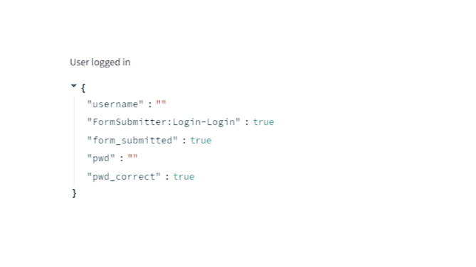

# Authentication in Streamlit

## Authentication points
<ul>
    <li><strong>Streamlit supports authentication.</strong></li>
    <li><strong>The first way is not as secure as an SSO (Single-sign on) provider. It is good for a small app or the prototype but it's not a good option for a full-fledged application.</strong></li>
    <li><strong>There is a better way of handling authentication and that's done using Streamlit authenticator.</strong></li>
</ul>

## Project structure for authentication
<ul>
    <li><strong>Streamlit can store secrets. Expected to be stored in .streamlit/secrets.toml. Credentials are to be stored in that file and it should not be publicly available.</strong></li>
    <li><strong>So, we should use .gitgnore for the file.</strong></li>
    <li><strong>Use session state to verify if a user enters credentials correctly and then login.</strong></li>
</ul>

## Streamlit Authenticator usage
<ul>
    <li><strong>A component developed by the community.</strong></li>
    <li><strong>Installation: - pip install streamlit-authenticator.</strong></li>
    <li><strong>Focuses entirely on managing credentials and adding security to streamlit apps.</strong></li>
    <li><strong>Uses session state and JWT token so that the user can login once and access different parts of the app.</strong></li>
</ul>

## Functionalities of streamlit authenticator
<ul>
    <li><strong>Hash passwords.</strong></li>
    <li><strong>Authenticate users.</strong></li>
    <li><strong>Login and logout logic.</strong></li>
    <li><strong>Password reset.</strong></li>
    <li><strong>Register new users.</strong></li>
    <li><strong>Logic when credentials are forgotten.</strong></li>
    <li><strong>Update user details.</strong></li>
</ul>

## Basic Password Authentication

## Basic Authentication using username

