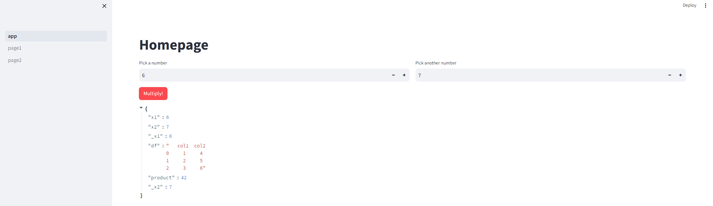
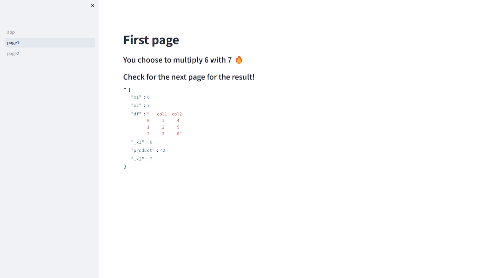
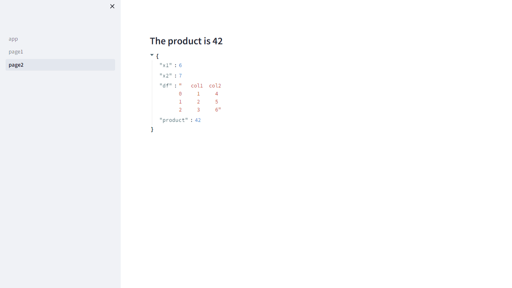

# Multipage app

<strong>A multipage app is easier to maintain and navigate. For this one, we need an entrypoint file, and then we can specify the other pages.</strong>

## Add pages to the app
<ul>
    <li>Create a pages folder and add the python files.</li>
    <li>Pages will appear automatically in the sidebar component.</li>
</ul>

## Naming the pages
  Filenames have 4 parts.
<ul>
    <li>A number: the filename can be prefixed with a number to specify order.</li>
    <li>A seperator: "-", "_" or a space.</li>
    <li>A label: everything that precedes .py</li>
    <li>The extension: .py</li>
</ul>
Examples:
<table>
    <tr>
        <th>Filename</th>
        <th>Rendered name</th>
    </tr>
    <tr>
        <td>1-main.py</td>
        <td>main</td>
    </tr>
    <tr>
        <td>2_🔥_home.py</td>
        <td>🔥 home</td>
    </tr>
    <tr>
        <td>_10_reasons_to_love_streamlit.py</td>
        <td>10 reasonst to love streamlit</td>
    </tr>
</table>

## Passing data between pages
We can do this by keeping the data in st.session_state.

## Error
When a widget is rendered on the UI and has a key, streamlit initializes the state with a value. When the widget is not rendered, streamlit deletes the key of that widget. This happens when we switch pages! If the widget is not rendered on another page, we lose its state.

## How to get rid of the Error
Think of widget keys as beining seperate from values you want to keep. They are temporary. Store values in permanent keys (Using a callbak) Reassign the value from the permanent key to the temporary widget key.

## Demo pages

