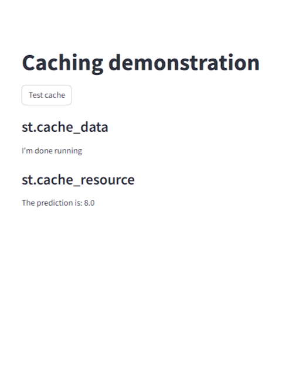

# Cache

## Caching basics
<ul>
    <li><strong>cache_data is used to store anything that returns serializable object (str, int, float, DataFrame, array, list, etc.).</strong></li>
    <li><strong>cache_resources should be available across users, sessions and returns. It should be limited to ML models, database connections.</strong></li>
    <li><strong>When we return one or some UI elements or widgets in streamlit from a function, then we can use caching sometimes or sometimes not. </strong></li>
</ul>

### Check the .py files to get to know the advance usage of caching and possble problems that can be generated by mutation and concurrency problem. 

## Mutation
<strong>Mutation is a change made to the output of a function after the function was called.</strong>

## Concurrency
<strong>Concurrency is multiple sessions causing changes. Example: - We have the same users using the app at the same time.</strong>

## cache_data prcoess: - 
<ul>
    <li><strong>Suppose, we are caching a function that returns a table as its output.</strong></li>
    <li><strong>After running the result is then sent to the cache.</strong></li>
    <li><strong>A copy is made from the cache after that.</strong></li>
    <li><strong>That copy is then sent to the browser.</strong></li>
    <li><strong>Then we manipulate a copy of the output that is shown from the cache.</strong></li>
    <li>
        <ul>
            <li><strong>Pros</strong>: - Copying the results prevents mutation and concurrency issues.</li>
            <li><strong>Cons</strong>: - In the case of a large dataset, it takes a lot of time.</li>
        </ul>
    </li>
</ul>

## cache_resource prcoess: - 
<ul>
    <li><strong>We have a function and it returns a machine learning model.</strong></li>
    <li><strong>After running it is sent to the cache and the result is then shown to the browser window.</strong></li>
    <li>
        <ul>
            <li><strong>Pros</strong>: - No copy is being made here. It saves memory. The same object is being shown to all the users and sessions.</li>
            <li><strong>Cons</strong>: - Make sure the object is not mutated.</li>
        </ul>
    </li>
</ul>

## Working with large datasets: - 
<ul>
    <li><strong>This is a situation where cache_resource can become useful.</strong></li>
    <li><strong>In the case of millions of rows, if we use cache_data, millions of copies are created and this takes time. On the contrary, while using cache_resource, there is no delay, because we will not be using copy.</strong></li>
</ul>